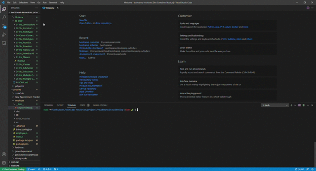

**Susanne's Portfolio**

This application demonstrates my skill in generating a README from user input from the node command line.

**Link**

The link to the deployed application is : https://susanne85.github.io/susannesPortfolio/

**Technologies Utilised**

. Node 

. Inquirer

**Application Display**

The attached video shows the inputs to the application.
                                                

This video shows the resultant README when no installation, usage, contributions, tests or questions details are entered.

**Liscense**

. MIT

**Contact information**

Susanne Bilney 
email: xkqk2010@gmail.com

